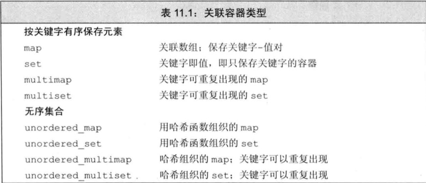
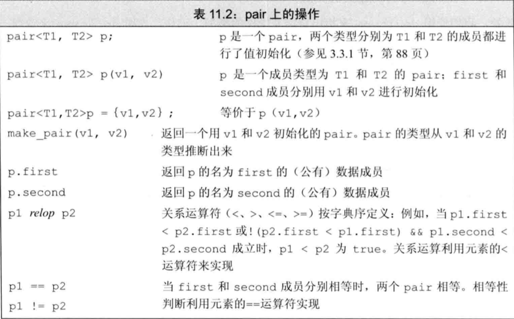
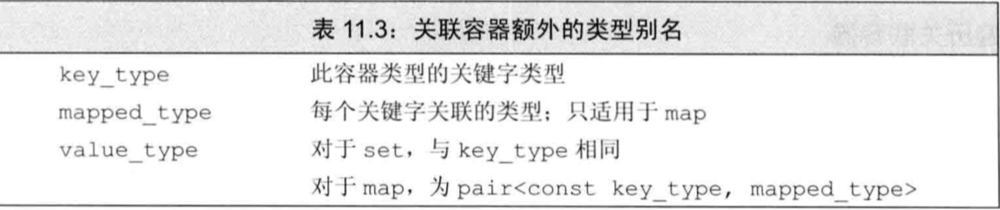
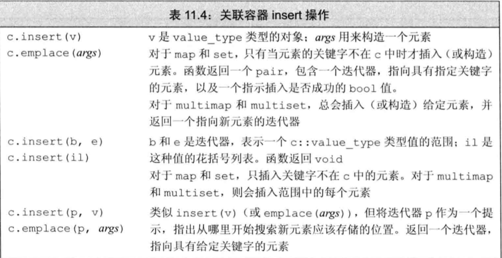
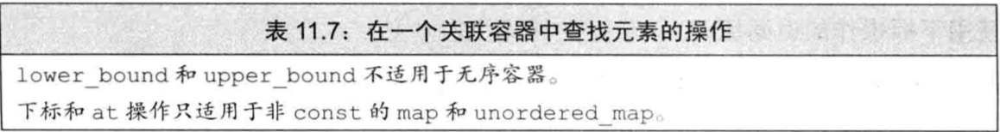
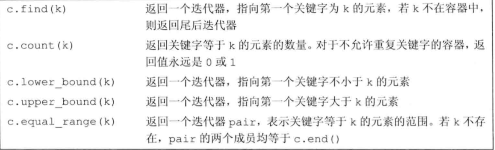

# 第11章 关联容器

关联容器和顺序容器有着根本的不同：关联容器中的元素是按关键字来保存和访问的。与之相对，顺序容器中的元素是按它们在容器中的位置顺序保存和访问的。

虽然关联容器的很多行为与顺序容器相同，但其不同之处反映了关键字的作用。

标准库提供了8个关联容器，如表11.1所示。这8个容器间的不同体现在三个维度上：每个容器（1）或者是一个`set`，或者是一个`map`；（2）或者要求不重复的关键字，或者允许重复关键字；（3）按顺序保存元素，或无序保存。允许重复关键字的容器的名字中都包含单词`multi`；不保持关键字按顺序存储的容器的名字都以单词`unordered`开头。因此一个`unordered_multi_set`是一个允许重复关键字，元素无序保存的集合，而一个`set`则是一个要求不重复关键字，有序存储的集合。无序容器使用哈希函数来组织元素。



## 11.1 使用关联容器

#### 使用map

一个经典的使用关联数组的例子是单词计数程序：

```cpp
map<string,size_t> word_count;
string word;
while(cin >> word)
    ++word_count[word]; //提取word的计数器并将其加1
for (const auto &w : word_count) //对map中的每个元素打印结果
    cout << w.first << " occurs " << w.second << ((w.second>1)?" times":" time") << endl;
```

#### 使用set

上一个示例程序的一个合理扩展是：忽略常见单词，如“the”、“and”、“or”等。我们可以使用`set`保存想忽略的单词，只对不在集合中的单词统计出现次数：

```cpp
map<string,size_t> word_count;
set<string> exclude = {"The","But","And","Or","An","A",
                        "the","but","and","or","an","a"};
string word;
while(cin >> word)
    //只统计不在exclude中的单词
    if(exclude.find(word) == exclude.end())
        ++word_count[word];
for (const auto &w : word_count)
    cout << w.first << " occurs " << w.second << ((w.second>1)?" times":" time") << endl;
```

## 11.2 关联容器概述

### 11.2.1 定义关联容器

```cpp
map<string,size_t> word_count; //空容器
//列表初始化
set<string> exclude = {"The","But","And","Or","An","A",
                        "the","but","and","or","an","a"};
//三个元素：
map<string,string> authors = {{"Joyce","James"},{"Austen","Jane"},{"Dickens","Charles"}};
```

#### 初始化multimap或multiset

```cpp
vector<int> ivec;
for (vector<int>::size_type i = 0;i !=10; ++i){
    ivec.push_back(i);
    ivec.push_back(i); //每个数重复保存一次
}
//iset包含来自ivec的不重复的元素；miset包含所有20个元素
set<int> iset(ivec.cbegin(),ivec.cend());
multiset<int> miset(ivec.cbegin(),ivec.cend());
cout << ivec.size() << endl;  // 20
cout << iset.size() << endl;  // 10
cout << miset.size() << endl; //20
```

### 11.2.2 关键字类型的要求

#### 有序容器的关键字类型

#### 使用关键字类型的比较函数

### 11.2.3 pair

```cpp
pair<string,string> anon; //保存两个string
pair<string,size_t> word_count;
pair<string,vector<int>> line; 
pair<string,string> author{"James","Joyce"};
cout << author.first << " " << author.second << endl;
```



#### 创建pair对象的函数

```cpp
pair<string,int> process(vector<string> &v)
{
    if(!v.empty())
        return {v.back(),v.back().size()}; //列表初始化
    else 
        return pair<string,int>(); //隐式构造返回值
}
```

## 11.3 关联容器操作

除了表9.2中列出的类型，关联容器还定义了表11.3中列出的类型。这些类型表示容器关键字和值的类型。



### 11.3.1 关联容器迭代器

```cpp
map<string,size_t> word_count;
string word;
while(cin >> word)
    ++word_count[word]; 
auto map_it = word_count.begin();
cout << map_it->first;
cout << " " << map_it->second; //
// map_it->first = "new key"; //错误：关键字是const的
++map_it->second;
```

#### set的迭代器是const的

```cpp
set<int> iset = {0,1,2,3,4,5,6,7,8,9};
set<int>::iterator set_it = iset.begin();
if(set_it != iset.end()){
    // *set_it = 42; //错误：set中的关键字是只读的
    cout << *set_it << endl; //
}
```

#### 遍历关联容器

```cpp
map<string,size_t> word_count;
string word;
while(cin >> word)
    ++word_count[word]; 
auto map_it = word_count.cbegin();
while (map_it != word_count.cend()){
    cout << map_it->first << " occurs "
         << map_it->second << " times" <<endl;
    ++map_it;
}
```

#### 关联容器和算法

### 11.3.2 添加元素

```cpp
vector<int> ivec = {2,4,6,8,2,4,6,8};
set<int> set2; //空集合
set2.insert(ivec.cbegin(),ivec.cend()); //set2有4个元素
set2.insert({1,3,5,7,1,3,5,7}); //set2现在有8个元素
```

#### 向map添加元素

```cpp
//向word_count插入word的4种方法
word_count.insert({word,1});
word_count.insert(make_pair(word,1));
word_count.insert(pair<string,size_t>(word,1))
word_count.insert(map<string,size_t>::value_type(word,1));
```



#### 检测insert的返回值

`insert`返回的值依赖于容器类型和参数。对于不包含重复关键字的容器，添加单一元素的`insert`和`emplace`版本返回一个`pair`，告诉我们插入操作时否成功。`pair`的`first`成员是一个迭代器，指向具有给定关键字的元素：`second`成员是一个`bool`值，指出元素是插入成功还是已经存在于容器中。如果关键字已在容器中，则`insert`什么事情也不做，且返回值中的`bool`部分为`false`。如果关键字不存在，元素被插入容器中，且`bool`值为`true`。

```cpp
map<string,size_t> word_count;
string word;
while(cin >> word){
    //插入一个元素，关键字等于word，值为1；
    //若word已在word_count中，insert什么也不做
    auto ret = word_count.insert({word,1});
    if(!ret.second) //word已在word_count中
        ++ret.first->second; //递增计数器
}
auto map_it = word_count.cbegin();
while (map_it != word_count.cend()){
    cout << map_it->first << " occurs "
         << map_it->second << " times" <<endl;
    ++map_it;
}
```

#### 展开递增语句

在这个版本的单词计数程序中，递增计数器的语句很难理解。通过增加一些括号来反映出运算符的优先级，会使表达式更容易理解一些：

```text
++((ret.first)->second);//等价的表达式
```

下面我们一步一步来解释此表达式：

* `ret`保存`insert`返回的值，是一个`pair`。
* `ret.first`是`pair`的第一个成员，是一个`map`迭代器，指向具有给定关键字的元素。
* `ret.first->`解引用此迭代器，提取`map`中的元素，元素也是一个`pair`。
* `ret.first->second` `map`中元素的值部分。
* `++ret.first->second`递增此值

再回到原来完整的递增语句，它提取匹配关键字`word`的元素的迭代器，并递增与我们试图插入到关键字相关联的计数器。

#### 向`multiset`或`multimap`添加元素

```cpp
multimap<string,string> authors;
authors.insert({"Barth,John","Sot-Weed Factor"});
authors.insert({"Barth,John","Lost in the Funhouse"});
```

对允许重复关键字的容器，接受单个元素的`insert`操作返回一个指向新元素的迭代器。这里无须返回一个`bool`值，因为`insert`总是向这类容器中加入一个新元素。

### 11.3.3 删除元素

关联容器提供一个额外的`erase`操作，它接受一个`key_type`参数。此版本删除所有匹配给定关键字的元素，返回实际删除的元素的数量。

对于保存不重复关键字的容器，`erase`的返回值总是0或1.若返回值为0，则表明想要删除的元素并不在容器中。

对于允许重复关键字的容器，删除元素的数量可能大于1：

```cpp
multimap<string,string> authors;
authors.insert({"Barth,John","Sot-Weed Factor"});
authors.insert({"Barth,John","Lost in the Funhouse"});
auto cnt = authors.erase("Barth,John");
cout << cnt << endl; //2
```


### 11.3.4 map的下标操作

`map`和`unordered_map`容器提供了下标运算符和一个对应的`at`函数。

```cpp
map<string,size_t> word_count;
//插入一个关键字为Anna的元素，关联值进行初始化，然后将1赋予它
word_count["Anna"] = 1;
```

#### 使用下标操作的返回值

`map`的下标运算符与我们用过的其他下标运算符的另一个不同之处是其返回类型。通常情况下，解引用一个迭代器所返回的类型与下标运算符返回的类型是一样的。但对`map`则不然：当对`map`进行下标操作时，会获得一个`mapped_type`对象；但当解引用一个`map`迭代器时，会得到一个`value_type`对象。

与其他下标运算符相同的是，`map`的下标运算符返回一个左值。由于返回的是一个左值，所以我们既可以读页可以写元素：

```cpp
map<string,size_t> word_count;
// //插入一个关键字为Anna的元素，关联值进行初始化，然后将1赋予它
word_count["Anna"] = 1;
cout << word_count["Anna"] << endl; //用Anna作为下标提取元素
++word_count["Anna"]; //提取元素，将其增加1
cout << word_count["Anna"] << endl;  //提取元素并打印它；会打印出2
```

### 11.3.5 访问元素





#### 对map使用find代替下标操作

对`map`和`unordered_map`类型，下标运算符提供了最简单的提取元素的方法。但是，如我们所见，使用下标操作有一个严重的副作用：如果关键字还未在`map`中，下标操作会插入一个具有给定关键字的元素。这种行为是否正确完全依赖于我们的预期是什么。例如，单词计数程序依赖于这样一个特性：使用一个不存在的关键字作为下标，会插入一个新元素，其关键字为给定关键字，其值为0，也就是说，下标操作的行为符合我们的预期。

但有时，我们只想知道一个给定关键字是否在`map`中，而不像改变`map`。这样就不能使用下标运算符来检查一个元素是否存在，因为如果关键字不存在的话，下标运算符会插入一个新元素。在这种情况下，应该使用find:

```cpp
if(word_count.find("foobar") == word_count.end())
    cout << "foobar is not in the map" << endl;
```

#### 在multimap或multiset中查找元素

#### 一种不同的，面向迭代器的解决方法

### 11.3.6 一个单词转换的map

#### 单词转换程序

#### 建立转换映射

#### 生成转换文本

## 11.4 无序容器

新标准定义了4个`无序关联容器（unordered associative container)`。这些容器不是使用比较运算符来组织元素，而是使用一个`哈希函数（hash function）`和关键字类型的`==`运算符。在关键字类型的元素没有明显的序关系的情况下，无序容器是非常有用的。在某些应用中，维护元素的序代价非常高昂，此时无序容器也很有用。

虽然理论上哈希技术能获得更多的平均性能，但在实际中想要达到很好的效果还需要进行一些溪能测试和调优工作。因此，使用无序容器通常更为简单。

#### 使用无序容器

用`unordered_map`重写最初的单词计数程序：

```cpp
unordered_map<string,size_t> word_count;
string word;
while(cin >> word)
    ++ word_count[word];
for ( const auto &w: word_count){
    cout << w.first << "occurs " << w.second
         << ((w.second>1) ? " times" : " time") << endl;
}
```

#### 管理桶

无序容器在存储上组织为一组桶，每个桶保存零个或多个元素。无序容器使用一个哈希函数将元素映射到桶。为了访问一个元素，容器首先计算元素的哈希值，它指出应该搜索哪个桶。容器将具有一个特定哈希值的所有元素都保存在相同的桶中。如果容器允许重复关键字，所有具有相同关键字的元素也都会在同一个桶中。因此，无序容器的性能依赖于哈希函数的质量和桶的数量和大小。

对于相同的参数，哈希函数必须总是产生相同的结果。理想情况下，哈希函数还能将每个特定的值映射到唯一的桶。但是，将不同关键字的元素映射到相同的桶也是允许的。当一个桶保存多个元素时，需要顺序搜索这些元素来查找我们想要的那个。计算一个元素的哈希值和桶中搜索通常都是很快的操作。但是，如果一个桶中保存了很多元素，那么查找一个特定元素就需要大量比较操作。

无序容器提供了一组管理桶的函数，例如11.8所示。这些成员函数允许我们查询容器的状态以及在必要时强制容器进行重组。


#### 无序容器对关键字类型的要求

默认情况下，无序容器使用关键字类型的`==`运算符来比较元素，它们还使用一个`hash<key_type>`类型的对象来生成每个元素的哈希值。标准库为内置类型提供了`hash`模版。还未一些标准库类型，包括`string`和我们将要在第12章介绍的智能指针类型定义了`hash`。因此，我们可以直接定义关键字是内置类型、`string`还是只能指针类型的无序容器

