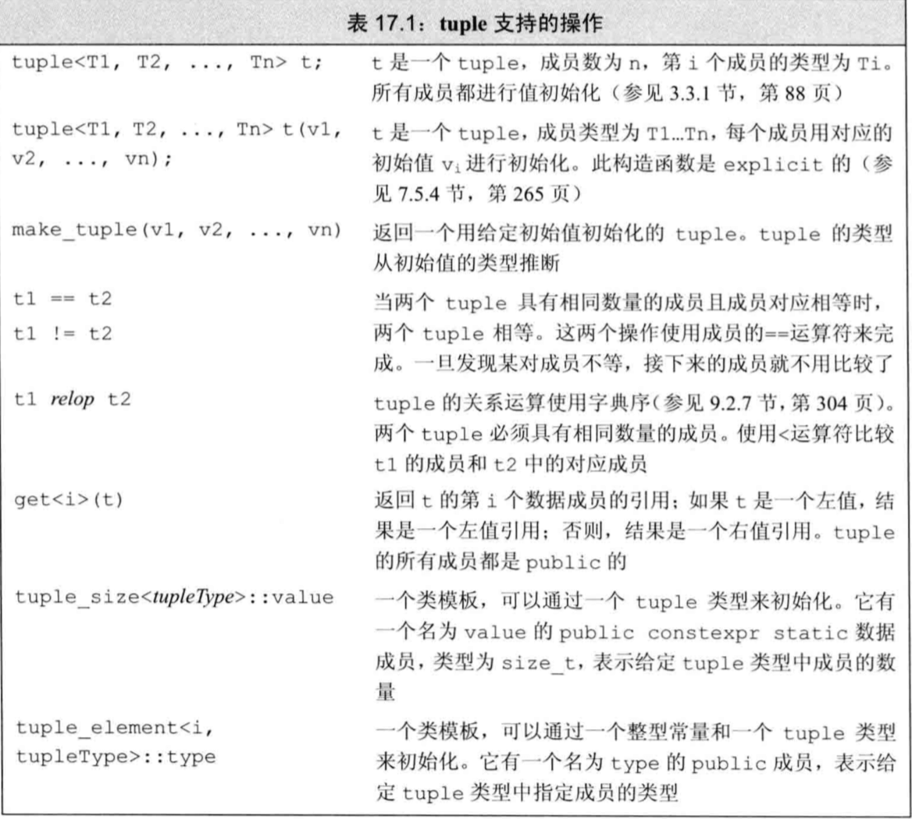
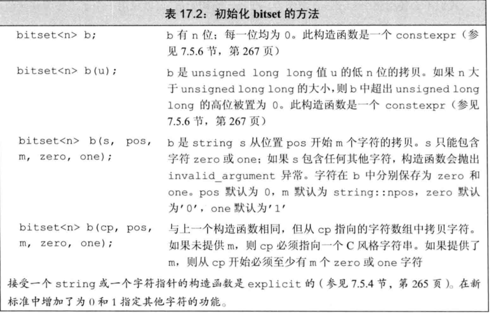
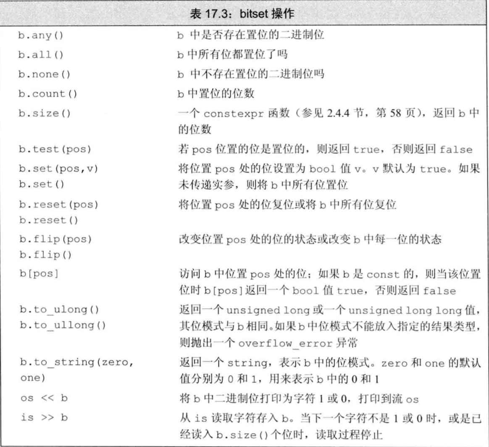
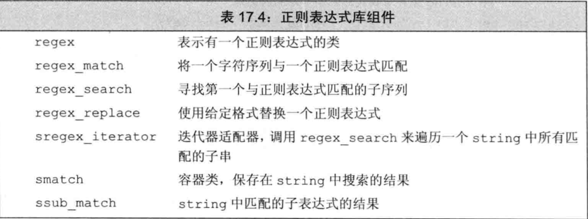
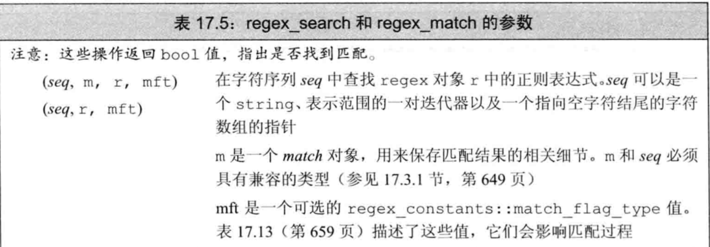
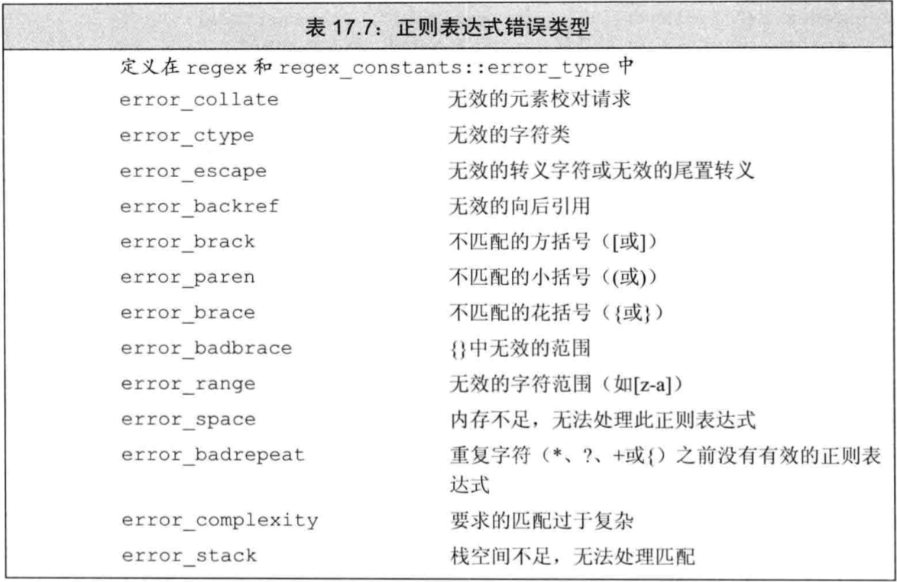

# 第17章 标准库特殊设施

## 17.1 tuple类型




### 17.1.1 定义和初始化tuple

```cpp
tuple<size_t,size_t,size_t> threeD;//三个成员都设置为0
//为每个成员提供一个初始化值。tuple的这个构造函数是explicit的，因此必须使用直接初始化语法
tuple<string,vector<double>,int,list<int>> someVal("constants",{3.14,2.718},42,{0,1,2,3,4,5});
// tuple<size_t,size_t,size_t> threeD = (1,2,3); //错误
```

类似`make_pair`函数，标准库定义了`make_tuple`函数，我们还可以用它来生成`tuple`对象。

```cpp
auto item = make_tuple("0-999-7845-X",3,20.00);
```

#### 访问tuple的成员

```cpp
auto book = get<0>(someVal); //返回item的第一个成员
auto cnt = get<1>(someVal); //返回item的第二个成员
auto price = get<2>(someVal); //返回item的最后一个成员
```
如果不知道一个`tuple`准确的类型细节信息，可以用两个辅助类模版来查询`tuple`成员的数量和类型。

```cpp
typedef decltype(item) trans; //trans是item的类型
//返回trans类型对象中成员的数量
size_t sz = tuple_size<trans>::value;//返回3
//cnt的类型与item中的第二个成员相同
tuple_element<1,trans>::type cnt = get<1>(item);//cnt是一个int
```
### 17.1.2 使用tuple返回多个值


## 17.2 BITSET类型


### 17.2.1 定义和初始化bitset



#### 用unsigned初始化bitset

```cpp
//bitvec1比初始值小；初始值中的高位被丢弃
bitset<13> bitvec1(0xbeef);
cout << bitvec1 << endl; //二进制位序列为1111011101111
//bitvec2比初始值大；它的高位位置0
bitset<20> bitvec2(0xbeef);
cout << bitvec2 << endl; //00001011111011101111
//在64位机器中，long long 0ULL是64个0比特，因此~0ULL是64个1
bitset<128> bitvec3(~0ULL);
cout << bitvec3 << endl; //0~63位为1；63~127位为0
```

#### 从一个string初始化bitset

```cpp
string str("1111111000000011001101");
bitset<32> bitvec5(str,5,4); //从str[5]开始的四个二进制位，1100
cout << bitvec5 << endl; //00000000000000000000000000001100
bitset<32> bitvec6(str,str.size()-4); //使用最后四个字符
cout << bitvec6 << endl; //00000000000000000000000000001101
```
### 17.2.2 bitset操作



```cpp
bitset<32> bitvec(1U); //32位；低位为1，剩余位数位0
cout << bitvec << endl; //00000000000000000000000000000001
bool is_set = bitvec.any(); // true，因为有1位置位
bool is_not_set = bitvec.none(); //false，因为有1位置位了
bool all_set = bitvec.count(); //返回1
size_t sz = bitvec.size(); //返回32
bitvec.flip();//翻转bitvec中所有位
cout << bitvec << endl; //11111111111111111111111111111110
bitvec.reset();//将所有位复位
cout << bitvec << endl; //00000000000000000000000000000000
bitvec.set();//将所有位置位
cout << bitvec << endl; //11111111111111111111111111111111
```

```cpp
bitvec.flip(0); //翻转第一位
cout <<bitvec << endl; //00000000000000000000000000000000
bitvec.set(bitvec.size() - 1);//置位最后一位
bitvec.set(0,0);//复位第一位
bitvec.test(0);//返回false，因为第一位是复位的
```
#### 提取bitset的值

```cpp
bitset<32> bitvec7("1000");
unsigned long ulong = bitvec7.to_ulong();
cout << "ulong = " << ulong << endl; //8
```

#### bitset的IO运算符

```cpp
bitset<16> bits;
cin >> bits;
cout << "bits: " << bits << endl;
```

#### 使用bitset

## 17.3 正则表达式





### 17.3.1 使用正则表达式库

```cpp
//查找不在字符c之后的字符串ci
string pattern("[^c]ei");
//我们需要包含pattern的整个单词
pattern = "[[:alpha:]]*" + pattern + "[[:alpha:]]*";
regex r(pattern); //构建一个用于查找模式的regex
smatch results; //定义一个对象保存搜索结构
//定义一个string保存于模式匹配和不匹配的文本
string test_str = "receipt freind theif receive";
if(regex_search(test_str,results,r)) //如果有匹配子串
    cout << results.str() << endl; //freind
```

#### 指定regex对象的选项

#### 指定或使用正则表达式时的错误



### 17.3.2 匹配与Regex迭代器类型

### 17.3.3 使用子表达式

### 17.3.4 使用regex_replace

## 17.4 随机数

### 17.4.1 随机数引擎和分布

### 17.4.2 其他随机数分布

## 17.5 IO库再探

### 17.5.1 格式化输入与输出

### 17.5.2 未格式化的输入/输出操作

### 17.5.3 流随机访问