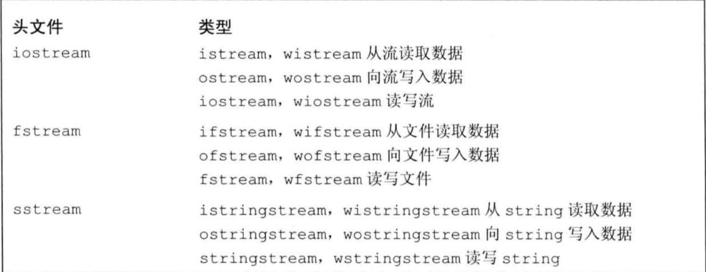
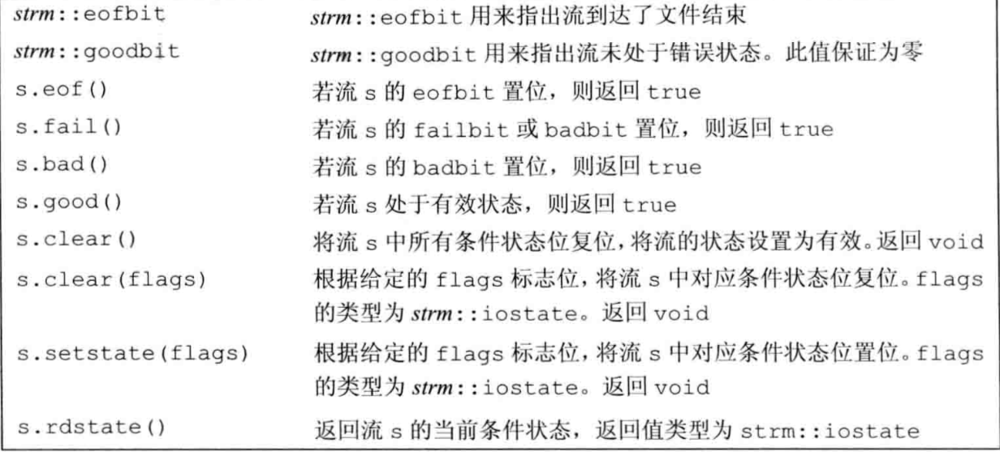
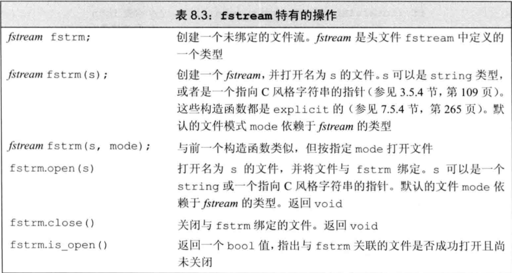
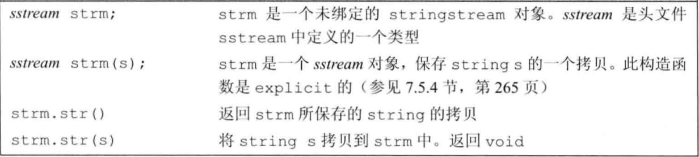

# 第8章 IO库

## 8.1 IO类

为了支持不同种类的IO处理操作，在`istream`和`ostream`之外，标准库还定义了其他一些`IO`类型。分别定义在三个独立的头文件中：`iostream`定义了用于读写流的基本类型，`fstream`定义了读写命名文件的类型，`sstream`定义了读写内存`string`对象的类型。



#### IO类型间的关系

### 8.1.1 IO对象无拷贝或赋值

### 8.1.2 条件状态

下表列出了IO类所定义的一些函数和标志，可以帮助我们访问和操纵流的`条件状态（condition state）`。




#### 查询流的状态

#### 管理条件状态

### 8.1.3 管理输出缓冲

#### 刷新输出缓冲区

#### unitbuf操纵符

#### 关联输入和输出流

## 8.2 文件输入输出



### 8.2.1 使用文件流对象

```cpp
#include <iostream>
#include <fstream>
#include "Sales_data.h"
using std::ifstream;
using std::ofstream;
using std::cerr;
int main(int argc,char *argv[])
{   
    ifstream input(argv[1]);
    ofstream output(argv[2]);
    Sales_data total;
    if(read(input,total)){
        Sales_data trans;
        while(read(input,trans)){
            if(total.isbn() == trans.isbn())
                total.combine(trans);
            else {
                print(output,total) << endl;
                total = trans;
            }
        }
        print(output,total) << endl;
     }else{
         cerr << "No data?!" << endl;
     }

}
```

#### 用fsteam代替iostream&

#### 成员函数open和close

### 8.2.2 文件模式

#### 以out模式打开文件会丢弃已有数据

#### 每次调用open时都会确定文件模式

## 8.3 string流



### 8.3.1 使用istringstream

### 8.3.2 使用ostringstream

```cpp
#include <iostream>
#include <sstream>
#include <string>
#include <vector>
using std::istream;
using std::istringstream;
using std::ostringstream;
using std::string;
using std::vector;
using std::cin;
using std::endl;
using std::cerr;
using std::cout;

bool valid(const string& nums)
{
    return true;
}

const string& format(const string& nums)
{
    return nums;
}

struct PersonInfo {
    string name;
    vector<string> phones;
};

int main(int argc,char *argv[])
{   
    string line,word;
    vector<PersonInfo> people;
    while (getline(cin,line)){
        PersonInfo info;
        istringstream record(line);
        record >> info.name;
        while (record >> word)
            info.phones.push_back(word);
        people.push_back(info);
    }
    for (const auto &entry : people)
    {
        ostringstream formatted, badNums;
        for (const auto &nums : entry.phones) {
            if (!valid(nums)){
                badNums << " " << nums;
            }else
                formatted << " " << format(nums);
        }
        if(badNums.str().empty())
            cout << entry.name << " " << formatted.str() << endl;
        else 
            cerr << "input error: " << entry.name 
            << " invalid number(s) " << badNums.str() << endl;
    }
}
```

